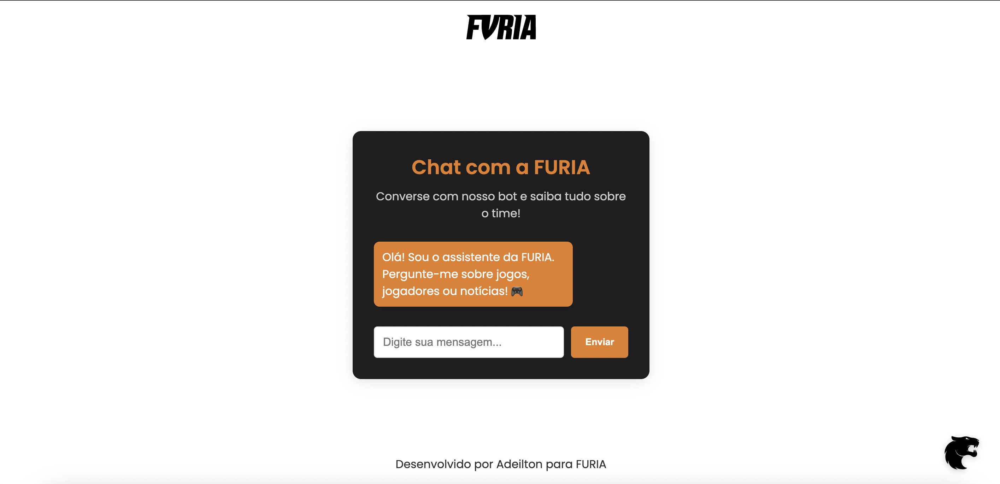

# 🎮 FURIA Chatbot

<div align="center">
  
</div>

Chatbot interativo sobre os times e jogos da FURIA Esports, desenvolvido com Python, Flask e IA generativa.

## ✨ Demonstração
<div align="center">
  
  <p><em>Interface do chatbot em funcionamento</em></p>
</div>

## 🛠️ Tecnologias
<div align="center">
  
  
  
</div>

## 🚀 Como Executar
```bash
# Clone o repositório
git clone https://github.com/adeillton/furia-chatbot.git

# Acesse a pasta do projeto
cd furia-chatbot

# Crie um ambiente virtual (opcional)
python -m venv venv
source venv/bin/activate  # Linux/Mac
venv\Scripts\activate     # Windows

# Instale as dependências
pip install -r requirements.txt

# Execute ("python3 app.py" caso não utilize ambiente virtual )
python app.py 
```
Acesse: `http://localhost:5050`

## 💡 Exemplos de Perguntas para o bot
- "Elenco do CS2?"  
- "Quando é o próximo jogo?"  
- "Onde assistir?"  

Desenvolvido por Adeilton Barros | 2025  

